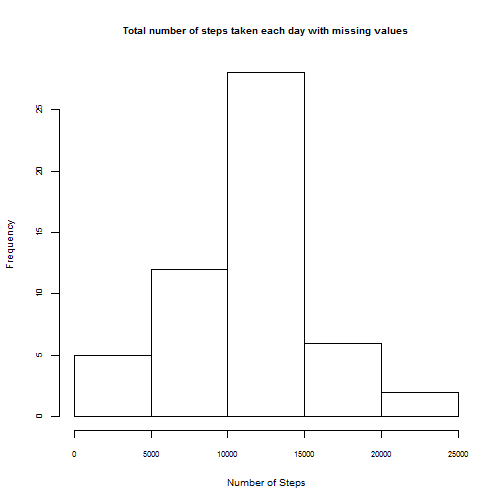
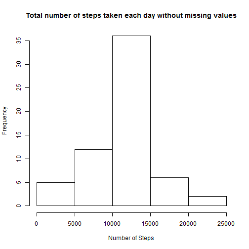

Reproducible Research: Peer Assessment 1

Loading data and setting directory


```r
setwd("C:/10624/Coursera_data science/Reproducible reserach/assignment1/repdata-data-activity/RepData_PeerAssessment1")
activity<- read.csv("./activity.csv")
```


Creating data frame and changing data types for analysis


```r
act_frame<- data.frame(activity)
act_frame<-transform(act_frame,steps=as.numeric(steps),interval=as.numeric(interval))
library("lubridate")
```

```
## Warning: package 'lubridate' was built under R version 3.0.3
```

```r
act_frame$date<- ymd(act_frame$date)
sapply(act_frame, class)
```

```
## $steps
## [1] "numeric"
## 
## $date
## [1] "POSIXct" "POSIXt" 
## 
## $interval
## [1] "numeric"
```


What is mean total number of steps taken per day?

1. Calculate the total number of steps taken per day


```r
step_tot <- aggregate(steps ~ date, act_frame, sum)
```


2. Make a histogram of the total number of steps taken each day


```r
par(cex.lab=0.8, cex.axis=0.7,cex.main=0.8)
hist(step_tot$steps, xlab = "Number of Steps", main = "Total number of steps taken each day with missing values")
```

 


3. Calculate and report the mean and median of the total number of steps taken per day


```r
mean(step_tot$steps)
```

```
## [1] 10766.19
```

```r
median(step_tot$steps)
```

```
## [1] 10765
```


What is the average daily activity pattern?


1. Make a time series plot (i.e. type = "l") of the 5-minute interval (x-axis) and the average number     of steps taken, averaged across all days (y-axis)


```r
step_pattern <- aggregate(steps ~ interval, act_frame, mean)
par(cex.lab=0.8, cex.axis=0.7,cex.main=0.8)
plot(step_pattern$interval, step_pattern$steps, type='l', col=1, 
     main="Average number of steps averaged over all days", xlab="Time Interval", ylab="Average number of steps")
```

 


2. Which 5-minute interval, on average across all the days in the dataset, contains the maximum number    of steps?


```r
max_step <- which.max(step_pattern$steps)
step_pattern[max_step, ]
```

```
##     interval    steps
## 104      835 206.1698
```


Imputing missing value


1. Calculate and report the total number of missing values in the dataset (i.e. the total number of       rows with NAs)


```r
sum(is.na(act_frame))
```

```
## [1] 2304
```


2. Devise a strategy for filling in all of the missing values in the dataset. The strategy does not       need to be sophisticated. For example, you could use the mean/median for that day, or the mean for     that 5-minute interval, etc.

   Answer: I replaced missing values with the mean for respective 5-minute interval.


```r
data_imputed <- act_frame
for (i in 1:nrow(data_imputed)) {
  if (is.na(data_imputed$steps[i])) {
    interval_value <- data_imputed$interval[i]
    steps_value <- step_pattern[
      step_pattern$interval == interval_value,]
    data_imputed$steps[i] <- steps_value$steps
  }
}
```


2. Create a new dataset that is equal to the original dataset but with the missing data filled in.

   Answer: Above created dataset namely 'data_imputed' is the one with the missing data filled in. 
           1) act_frame data: data with NA
           2) imputed data: data with no NA


```r
head(data_imputed) #data without NA
```

```
##       steps       date interval
## 1 1.7169811 2012-10-01        0
## 2 0.3396226 2012-10-01        5
## 3 0.1320755 2012-10-01       10
## 4 0.1509434 2012-10-01       15
## 5 0.0754717 2012-10-01       20
## 6 2.0943396 2012-10-01       25
```

```r
head(act_frame)    #data with NA
```

```
##   steps       date interval
## 1    NA 2012-10-01        0
## 2    NA 2012-10-01        5
## 3    NA 2012-10-01       10
## 4    NA 2012-10-01       15
## 5    NA 2012-10-01       20
## 6    NA 2012-10-01       25
```


3.Make a histogram of the total number of steps taken each day and Calculate and report the mean and  median total number of steps taken per day. 


```r
step_tot_NONA <- aggregate(steps ~ date, data = data_imputed, sum)
hist(step_tot_NONA$steps, xlab = "Number of Steps", main = "Total number of steps taken each day without missing values")
```

 


4. Mean and median total number of steps taken per day withoout NA


```r
mean(step_tot_NONA$steps)
```

```
## [1] 10766.19
```

```r
median(step_tot_NONA$steps)   
```

```
## [1] 10766.19
```


5. Do these values differ from the estimates from the first part of the assignment? 

   Answer: Mean value remains same while median value lowers by 1.19.


```r
mean(step_tot$steps)
```

```
## [1] 10766.19
```

```r
median(step_tot$steps)
```

```
## [1] 10765
```

```r
mean(step_tot_NONA$steps)
```

```
## [1] 10766.19
```

```r
median(step_tot_NONA$steps) 
```

```
## [1] 10766.19
```


6.What is the impact of imputing missing data on the estimates of the total daily number of steps?

  Answer:Imputing missing values doesn't affect much on total daily number of steps, since after               imputation 'mean' of steps remains same and 'median' changes only by 1.19.


Are there differences in activity patterns between weekdays and weekends?


1. Create a new factor variable in the dataset with two levels - "weekday" and "weekend" indicating      whether a given date is a weekday or weekend day.
   

```r
data_imputed$weekday=weekdays(data_imputed$date)
data_imputed$weekday_type <- ifelse(data_imputed$weekday == "Saturday" | data_imputed$weekday == 
                                 "Sunday", "Weekend", "Weekday")
data_imputed$weekday_type <- factor(data_imputed$weekday_type)
head(data_imputed)
```

```
##       steps       date interval weekday weekday_type
## 1 1.7169811 2012-10-01        0  Monday      Weekday
## 2 0.3396226 2012-10-01        5  Monday      Weekday
## 3 0.1320755 2012-10-01       10  Monday      Weekday
## 4 0.1509434 2012-10-01       15  Monday      Weekday
## 5 0.0754717 2012-10-01       20  Monday      Weekday
## 6 2.0943396 2012-10-01       25  Monday      Weekday
```


2.Make a panel plot containing a time series plot (i.e. type = "l") of the 5-minute interval (x-axis)   and the average number of steps taken, averaged across all weekday days or weekend days (y-axis). 


```r
panel_plot = aggregate(steps ~ interval + weekday_type, data_imputed, mean)
library(lattice)
xyplot(steps ~ interval | factor(weekday_type), data = panel_plot, aspect = 1/2, 
       type = "l")
```

 

